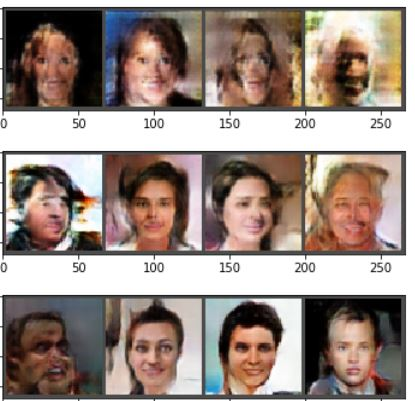
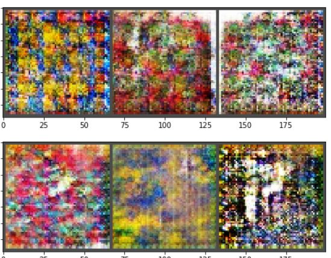

# GAN
Generative Adversarial Network on CelebFaces and African Fabric datasets

# Overview

This project involved implementing a GAN (Generative Adversarial Network) and taking a dataset from the internet and implementing the GAN to produce copies. Two datasets were tried, <a href="https://www.kaggle.com/jessicali9530/celeba-dataset">CelebFaces dataset</a> and the <a href="https://www.kaggle.com/mikuns/african-fabric">African fabrics</a> dataset from Kaggle. I first created a Generator consiting of convoultional layers interspersed with BatchNorm layers. This Generator would be provided as input random gaussian noise which it would then pass through the layers to create rgb images. The Discriminator is trying to asign high probabilities to images that are real, and low probabilities to images that are fake, i.e. produced by the Generator. I used Binary Cross Entropy loss because we basically have a 0,1 output here, 0 for fake 1 for real. The Discriminator is trying to minimize this loss while the Generator is trying to maximize this loss, hence the term "Adversarial".
This involved much squeezing/dimension footwork as well as keeping track of which machine wanted which outcome in terms of matrix outcomes. Below are the outcomes of the GAN on the CelebFaces dataset after 100 epochs.

To see the methods, see [GAN.ipynb](GAN.ipynb)

## Results
Outcome after 100 epochs
      

Next was trying the African Textile dataset. Same idea just different images. Here are the results from that.
      
